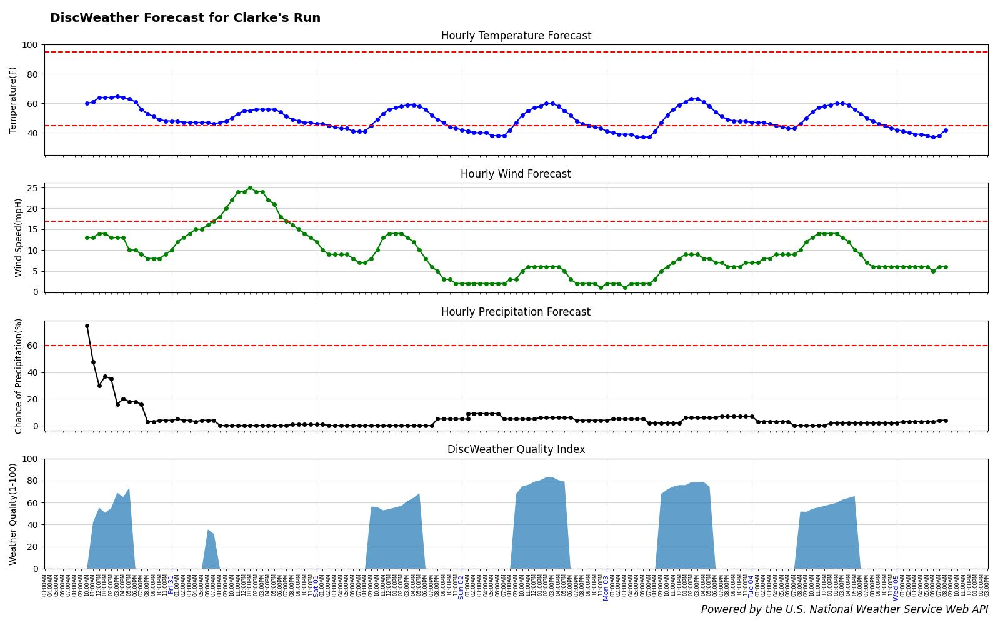
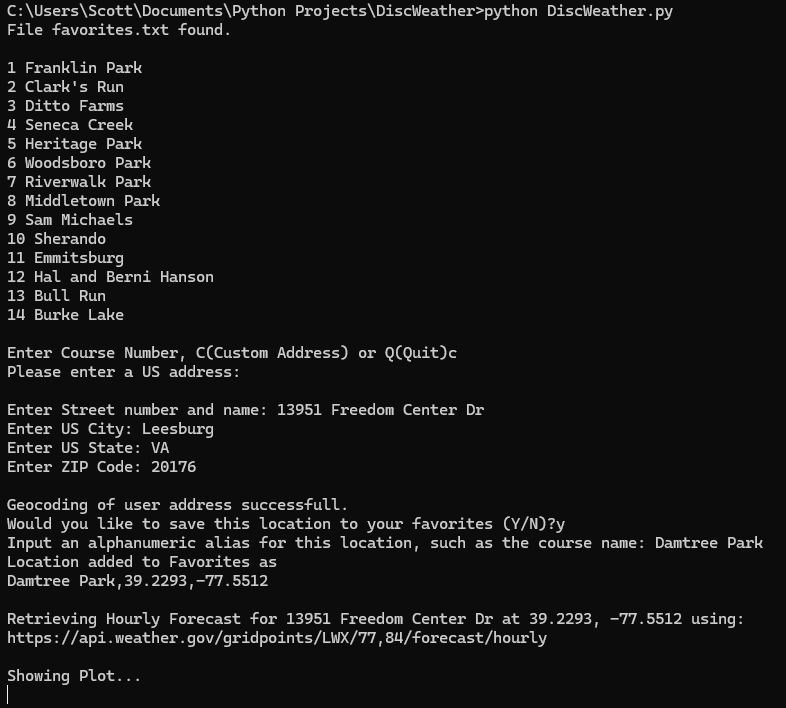

# DiscWeather: Weather Quality Prediction for Disc Golf

## About DiscWeather

The DiscWeather application is a Python script that gathers and displays the 6-day weather forecast for a specified location, then uses daylight, temperature, wind and chance of precipitation data to generate an hourly "Disc Weather Quality Index" to help users understand the most favorable upcoming time periods for disc golf at that location. 

The hourly Quality Index calculations range in value between 0 and 100 with 100 representing absolutely ideal weather conditions for disc golf 😎, and 0 indicating conditions in which one would very likely not enjoy playing disc golf at all 😒. The Quality Index calculation can be tuned through a variety of settings and thresholds as described further below.

Hourly forecast data are pulled from the U.S. National Weather Service Web API, and geocoding data for user-entered addresses are pulled from the U.S. Census Bureau Geocoder API.

## Requirements

To run the DiscWeather program on your computer, you must:

* Be able to access a command-line interface, such as Terminal for Mac or CMD prompt for Windows
* Have [Python](https://www.python.org/downloads/) installed, 
* Have the following Python packages installed using pip or a similar package manager:
    * sys
    * requests
    * json
    * matplotlib
    * dateutil
* Have the files "DiscWeather.py", "dwConfig.py" and "favorites.txt" in the same directory


## Usage

**To run DiscWeather using the [DiscWeather.py](DiscWeather.py) file:**

1. Open a command-line interface and navigate to the folder where `DiscWeather.py` is stored.
2. Type the following command: `python DiscWeather.py`
3. Press the "Enter" key

### Using Command Line Arguments:
DiscWeather.py can be optionally executed with the following command line arguments:
* "-h" or "--help" will print usage help to the console then halt the program
* "-n" or "--night" will override the "daylightOnly" boolean value in the "dwConfig.py" file to False, allowing night-time Quality Index calculations for Glow Disc golfing.
* "-p=*numHrs*" or "--plot=*numHrs*" will override the "numHours" value set in the "dwConfig.py" file with the *numHrs* value passed in with the command line argument.

For example, using either of the following commands to start DiscWeather will override the "dwConfig.py" "numHours" value and set the number of hours to be plotted by DiscWeather to 24:
* "python DiscWeather.py -p=24"
* "python DiscWeather.py --plot=24"


## The Program
On start-up, the program will show an enumerated list of favorite courses (locations) if a properly formatted "favorites.txt" file is found in the start-up directory.  Users will be prompted to either select a course from the favorites list (by number), enter "C" to enter a custom address to be geocoded, or enter "Q" to quit the program. If no favorites are found, only "C" and "Q" are offered.


If a favorite location is selected, the weather plot for that course will be shown after a small delay for data retrieval via the National Weather Service Web API. Output plots are made using the matplotlib python package and look like this:



#### Entering a Custom Address -
If the user chooses to enter a custom address, they must enter a valid continental U.S. address when prompted by providing:

* Street number and name
* City
* State (2-letter abbreviation)
* Zip Code

Invalid or non-continental U.S. addresses will fail the Geocoding test and users will be prompted to re-enter the address or Quit.

Once a valid address has been entered and successfully Geocoded, users will be asked if they would like to save the location to Favorites.  If so, they are prompted to enter a Course Name that will be stored in "favorites.txt" with the recently geocoded latitude and longitude values.  Address parameters are not saved into "favorites.txt", just corresponding latitude/longitude.



### Settings and Configuration:
DiscWeather Quality Index calculations are governed by settings and thresholds contained in the [dwConfig.py](dwConfig.py) file, an example of which is shown below:

```python
# dwConfig.py contents
numHours = 144          # Number of hours to plot: (from 12 to 156)
daylightOnly = True     # Set to false to allow night predictions for glow disc play

# Thresholds for calculating hourly DiscWeather scores:

LoT = 45        # Below which temp score will be 0. Above which score increases to max at MidLoT
MidLoT = 65     # Above which temp score will be max until MidHiT is reached
MidHiT = 85     # Above which temp score attenuates to 0 at HiT
HiT = 95        # Above which temp score will be 0
LoW = 8         # Below which wind score will be Max. Wind score attenuates to 0 at HiW
HiW = 17        # Above which wind score will be 0
LoP = 19        # Below which precip score will be Max. Precip score attenuates to 0 at HiP
HiP = 65        # Above which precip score will be 0

# Relative contributions for temperature, wind and precipitation to overall Quality Index:
MaxTScore = 40
MaxWScore = 35
MaxPScore = 100 - (MaxTScore + MaxWScore)
# The total for all 3 maximum sub-scores must add up to 100.
```

Below is a visual representation of how the individual scores are generated using the settings/threshold parameters for temperature, wind and precipitation respectively.  


When modifying settings and thresholds in "dwConfig.py", keep in mind that threshold values must have logically correct relative values for each sub-score calculation to execute. 

Specifically, the following ordinal relationships for thresholds must be met:
* *Temperature Score:* LoT < MidLoT <= MidHiT < HiT
* *Wind Score:* LoW < HiW
* *Precip Score:* LoP < HiP

The program will test for proper threshold relationships on start-up and exit with an error message if a threshold relationship problem is detected.

**Please note:**  MaxTScore + MaxWScore + MaxPScore must always = 100 points total

### Managing Favorite Locations Using favorites.txt:

The "favorites.txt" file holds favorite course information as text strings with the following format:
>*CourseName*,*latitude*,*longitude*

where:

* *CourseName* is an alphanumeric alias used to identify the course
* *latitude* is a string representation of location latitude in decimal degrees, and
* *longitude* is a string representation of location longitude in decimal degrees

"favorites.txt" can be edited by hand if desired, as long as each entry conforms to the format described above.  Below is an example file structure. (Lines beginning with a "#" character and empty lines will be ignored.)
```
#CourseName,Latitude,Longitude
Franklin Park,39.1302,-77.7435
Clarkes Gap,39.2292,-77.5505
Ditto Farms,39.6146,-77.6711
Seneca Creek,39.1368,-77.2597
Heritage Park,39.5025,-77.3493
Woodsboro Park,39.5333,-77.3074
Riverwalk Park,39.4335,-77.3891
Middletown Park,39.4495,-77.5279
Sam Michaels,39.3433,-77.8095
Sherando,39.0830,-78.1804
Emmitsburg,39.7036,-77.3327
Hal and Berni Hanson,39.9819,-77.5459
Bull Run,38.8077,-77.4775
Burke Lake,38.7637,-77.3042
```
#### End README.md